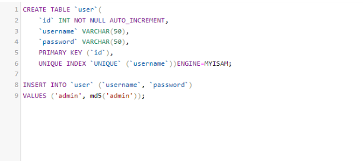
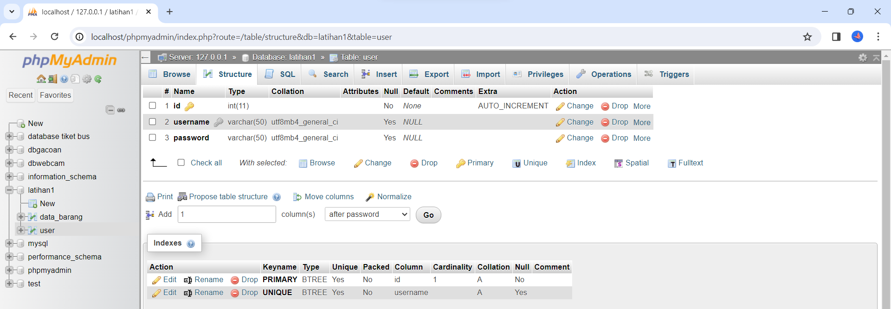
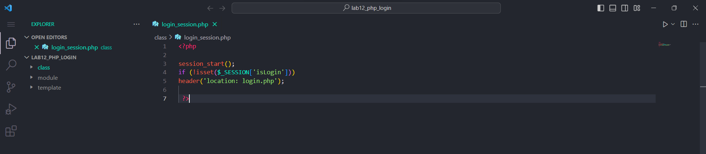
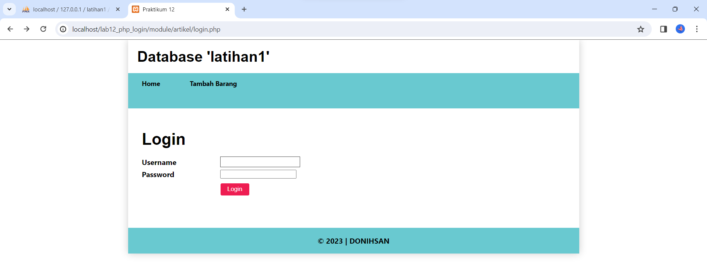
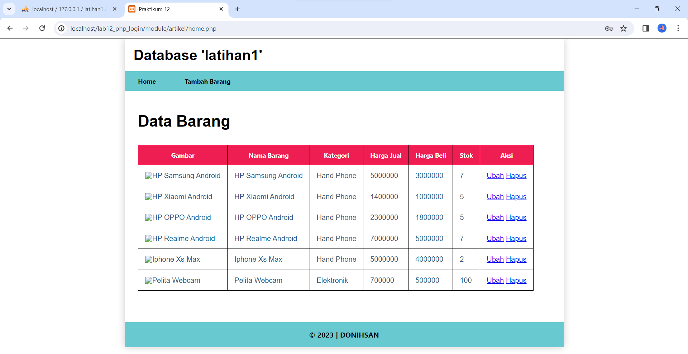

# Tugas Praktikum { Pertemuan ke 14 } 

|**Nama**|**NIM**|**Kelas**|**Matkul**|
|----|---|-----|------|
|Muhammad Ikhsan Fakhrudin|312210019|TI.22.A.2|Pemrograman Web 1|

# PHP Login

## Langkah-Langkah Praktikum

Membuka ``text editor`` , di sini saya menggunakan ***Visual Studio Code.***

## Start Apache dan MySQL server dari menu ``XAMPP Control``

**1. Membuat tabel ``user`` pada database ***latihan1*****

Setelah ``tabel user`` berhasil ditambahkan maka akan muncul output seperti ini :

**2. Membuat file ``login_session.php``**

**3. Membuat file ``login.php``**

***Output Halaman Login :***

- Username : admin

- Password : admin

***Output Ketika Berhasil Login :***

## SELESAI  
